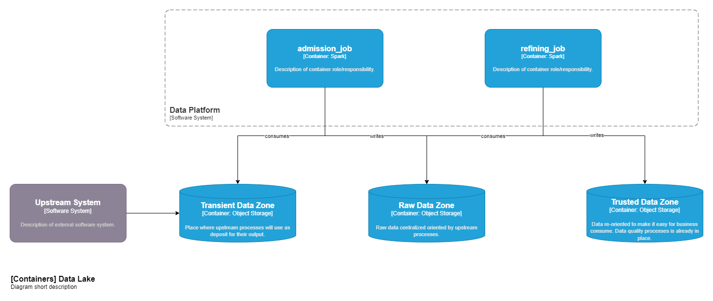

# Simple Pipeline

## Inputs
Consider a flow where several applications emit events as a result of your
processing. A pipeline is responsible for consuming these events and
make them available, from time to time, as files in a directory. The flow will be called
`upstream_default`.

Example payload of a saved event:
```json
{
    "event_id": "3aaafb1f-c83b-4e77-9d0a-8d88f9a9fa9a",
    "timestamp": "2021-01-14T10:18:57",
    "domain": "account",
    "event_type": "status-change",
    "data": {
        "id": 948874,
        "old_status": "SUSPENDED",
        "new_status": "ACTIVE",
        "reason": "Natus nam ad minima consequatur temporibus."
    }
}
```

### Schema Definition
Description of the data provided by upstream.

- **event_id**: Unique identifier. Maybe duplicated.
- **timestamp**: Date and time of the event creation.
- **domain**: Business domain responsible of the data ownership.
- **event_type**: Business process that the event represents.
- **data**: Schema uknown. It can be different for each `domain + event_type` combination. 
  - **id**: always present inside `data`. Represents an instance of `domain`.

### Output Expected
A summary of what should be expected as a output data set.

- Create a new dataset for each event combination. An event is defined by `domain + event_type`.
  - The output datasets type must by Parquet
  - The output datasets should be partitioned by year, month and day based on event's creation date and time.
  - In case of a duplicated event, consider only the most recent one. 


## Plans
Section that will present and discuss issues and intentions around implementation



### Data Storage Plan
The data should flow between Transient to Refined zones and the following is the specification of each one 
of the layers that will be used by this instance:

- **Transient Data Zone**: Ephemeral data repository where should be shared with upstream processes that aim to write data and with analytical workloads that will promote that data to places where business and data analysts can work peacefully. Once the data present here was consumed by an `admission_job`, this should be vanished.
  
- **Raw Data Zone**: Organization's raw data deposit. Some cleansing efforts could be executed here. Data will be oriented by upstream process that bring data to the platform.

- **Trusted Data Zone**: Place where it starts to orient data to help and make easy business analysis. Quality checks must be in place to guarantee, at least, the [6 Data Quality Dimensions](https://www.google.com/search?q=6+data+quality+dimensions) (also known as Accuracy, Completeness, Consistency, Uniqueness, Timeliness, and Validity).

- **[OUT OF THE SCOPE] Curated Data Zone**: Enriched datasets. Business logic already in place. 

### Data Transformation Plan


### Data Quality Plan